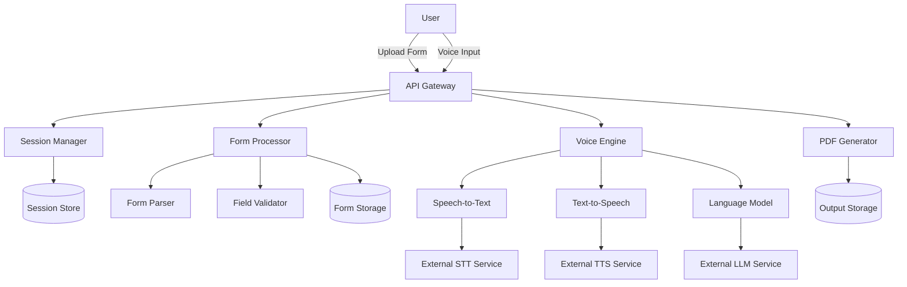
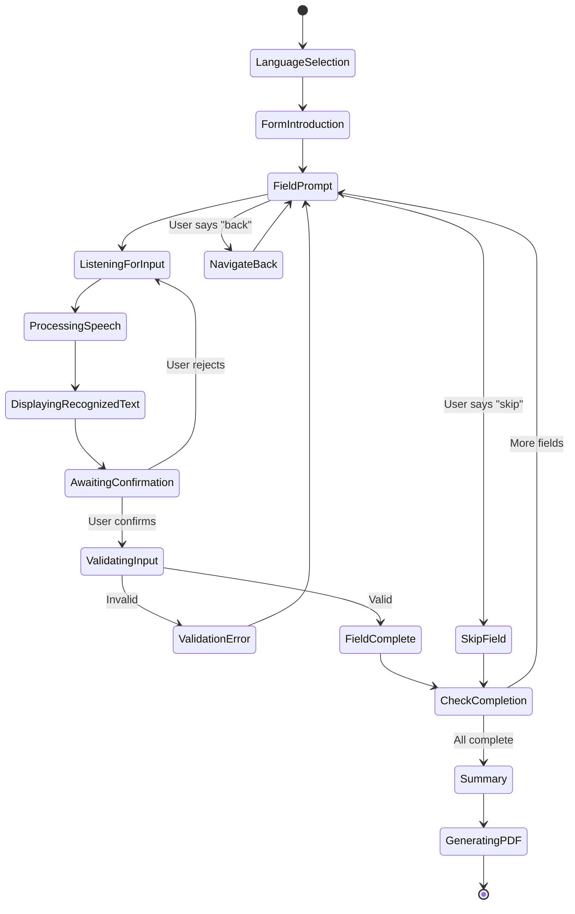

# Design Document: SarkarSaathi

## Overview

SarkarSaathi is a voice-first AI assistant that enables citizens to complete government forms through natural language conversation in regional languages. The system architecture follows a modular design with clear separation between form processing, voice interaction, session management, and PDF generation components.

The system workflow consists of:
1. Form upload and parsing to extract structure
2. Interactive voice-guided conversation to collect user data
3. Real-time validation of user inputs
4. Generation of structured filled PDF with user data

The design prioritizes accessibility, supporting multiple regional languages and providing fallback mechanisms for users with different needs and technical capabilities. This is an MVP-focused design suitable for hackathon or proof-of-concept implementation.

## Architecture

### High-Level Architecture



### Component Responsibilities

**API Gateway**: Entry point for all user interactions, routes requests to appropriate services, handles authentication and rate limiting

**Session Manager**: Manages user sessions, tracks progress, handles session persistence and recovery

**Form Processor**: Handles form upload, parsing, field extraction, and validation logic

**Voice Engine**: Orchestrates speech-to-text, text-to-speech, and conversational AI interactions

**PDF Generator**: Creates filled PDF documents from form templates and user data

### External Dependencies

The system relies on external AI services for core functionality:
- **Speech-to-Text API**: Converts user voice input to text in regional languages
- **Text-to-Speech API**: Generates voice guidance in regional languages
- **Large Language Model API**: Powers conversational flow and natural language understanding
- **PDF Processing Library**: Handles PDF manipulation and generation
- **Object Storage**: Stores uploaded forms and generated PDFs

### Technology Stack

The design uses pseudocode to remain language-agnostic. Implementation language will be selected during task creation phase. The architecture supports implementation in Python, TypeScript, Java, or other modern languages with good library support for PDF processing and HTTP APIs.

## Components and Interfaces

### 1. API Gateway

**Responsibilities:**
- Handle HTTP requests from clients
- Route requests to appropriate services
- Manage authentication and rate limiting
- Return responses to clients

**Key Endpoints:**

```
POST /api/forms/upload
  Input: multipart/form-data with file
  Output: { sessionId, formId, status }
  Description: Upload a government form document

POST /api/sessions/{sessionId}/language
  Input: { languageCode }
  Output: { status, message }
  Description: Set the preferred regional language for the session

POST /api/sessions/{sessionId}/voice-input
  Input: audio stream or base64 encoded audio
  Output: { recognizedText, fieldId, confidence, status }
  Description: Submit voice input for current form field

GET /api/sessions/{sessionId}/prompt
  Output: { audioUrl, text, currentField }
  Description: Get the current prompt for the user

POST /api/sessions/{sessionId}/confirm
  Input: { fieldId, value, confirmed }
  Output: { status, nextField }
  Description: Confirm or reject recognized input

POST /api/sessions/{sessionId}/navigate
  Input: { direction: "next" | "previous" | "skip" }
  Output: { status, currentField }
  Description: Navigate between form fields

GET /api/sessions/{sessionId}/generate-pdf
  Output: { pdfUrl, status }
  Description: Generate filled PDF after form completion

GET /api/sessions/{sessionId}/status
  Output: { progress, currentField, completedFields, totalFields }
  Description: Get current session progress

DELETE /api/sessions/{sessionId}
  Output: { status }
  Description: Delete session and all associated data
```

### 2. Session Manager

**Responsibilities:**
- Create and manage user sessions
- Persist session state
- Handle session recovery
- Clean up expired sessions

**Interface:**

```
class SessionManager:
  function createSession(formId: string) -> Session
  function getSession(sessionId: string) -> Session | null
  function updateSession(sessionId: string, data: SessionData) -> boolean
  function deleteSession(sessionId: string) -> boolean
  function cleanupExpiredSessions() -> void

class Session:
  sessionId: string
  formId: string
  userId: string | null
  languageCode: string
  createdAt: timestamp
  lastAccessedAt: timestamp
  expiresAt: timestamp
  status: "active" | "completed" | "expired"
  currentFieldIndex: integer
  formData: Map<fieldId, FieldValue>
  conversationHistory: Array<ConversationTurn>
  attemptCounts: Map<fieldId, integer>

class FieldValue:
  value: any
  confirmedAt: timestamp
  attempts: integer

class ConversationTurn:
  turn: integer
  speaker: "system" | "user"
  text: string
  timestamp: timestamp
```

### 3. Form Processor

**Responsibilities:**
- Accept and validate uploaded forms
- Parse form structure and extract fields
- Validate user inputs against field rules
- Store form templates and user data

**Interface:**

```
class FormProcessor:
  function uploadForm(file: File) -> FormDocument
  function parseForm(formId: string) -> FormStructure
  function validateField(fieldId: string, value: any, rules: ValidationRules) -> ValidationResult

class FormDocument:
  formId: string
  fileName: string
  fileType: "pdf" | "jpeg" | "png"
  fileSize: integer
  uploadedAt: timestamp
  storageUrl: string

class FormStructure:
  formId: string
  fields: Array<FormField>
  metadata: FormMetadata

class FormField:
  fieldId: string
  fieldType: "text" | "number" | "date" | "email" | "phone" | "checkbox" | "dropdown"
  label: string
  description: string
  required: boolean
  validationRules: ValidationRules
  metadata: FieldMetadata | null
  options: Array<string> | null  // for dropdown fields

class FieldMetadata:
  page: integer | null
  approximateLocation: string | null
  // Optional metadata for layout preservation attempts
  // Not guaranteed to be present or accurate for all forms

class FormMetadata:
  title: string | null
  totalPages: integer
  extractionMethod: string

class ValidationRules:
  maxLength: integer | null
  minLength: integer | null
  pattern: regex | null
  minValue: number | null
  maxValue: number | null
  customRules: Array<string>

class ValidationResult:
  valid: boolean
  errors: Array<string>
  sanitizedValue: any
```

### 4. Voice Engine

**Responsibilities:**
- Convert speech to text in regional languages
- Convert text to speech in regional languages
- Generate conversational prompts using LLM
- Manage conversation context and flow

**Interface:**

```
class VoiceEngine:
  function speechToText(audio: AudioData, languageCode: string) -> SpeechRecognitionResult
  function textToSpeech(text: string, languageCode: string) -> AudioData
  function generatePrompt(field: FormField, context: ConversationContext, languageCode: string) -> Prompt
  function generateConfirmation(field: FormField, value: any, languageCode: string) -> Prompt
  function generateError(error: ValidationError, languageCode: string) -> Prompt
  function generateSummary(formData: Map<fieldId, value>, languageCode: string) -> Prompt

class AudioData:
  format: "wav" | "mp3" | "ogg"
  sampleRate: integer
  channels: integer
  data: bytes

class SpeechRecognitionResult:
  text: string
  confidence: float
  languageCode: string
  alternatives: Array<string>

class Prompt:
  text: string
  audioUrl: string | null
  audioData: AudioData | null

class ConversationContext:
  sessionId: string
  currentField: FormField
  previousFields: Array<FormField>
  userResponses: Map<fieldId, value>
  clarificationCount: integer
  errorCount: integer
  attemptCount: integer
```

### 5. PDF Generator

**Responsibilities:**
- Generate structured filled PDF from form data
- Attempt layout preservation for supported forms
- Ensure all user data is included in output

**Interface:**

```
class PDFGenerator:
  function generateFilledPDF(formId: string, formData: Map<fieldId, value>, structure: FormStructure) -> PDFDocument
  function createStructuredPDF(formData: Map<fieldId, value>, structure: FormStructure) -> PDFDocument
  function savePDF(pdf: PDFDocument, sessionId: string) -> string  // returns URL

class PDFDocument:
  documentId: string
  pages: Array<PDFPage>
  metadata: PDFMetadata

class PDFPage:
  pageNumber: integer
  width: float
  height: float
  content: bytes

class PDFMetadata:
  title: string
  createdAt: timestamp
  generationMethod: "structured" | "layout_preserved"
```

**PDF Generation Strategy:**

The PDF generator creates a structured filled PDF output based on extracted form structure. For supported structured forms, layout preservation may be attempted, but this is not guaranteed. The primary goal is to produce a readable document containing all user inputs in a clear format.

Generation approaches:
1. **Structured Output** (Primary): Create a new PDF with clear sections, labels, and values
2. **Layout Preservation** (Optional): Attempt to overlay data on original form if metadata supports it
3. **Fallback**: Simple text-based PDF with all field labels and values

## Data Models

### Session Data Model

```
Session {
  sessionId: UUID (primary key)
  formId: string (foreign key)
  userId: string | null
  languageCode: string (default: "hi")
  status: enum ["active", "completed", "expired"]
  createdAt: timestamp
  lastAccessedAt: timestamp
  expiresAt: timestamp (createdAt + 24 hours)
  currentFieldIndex: integer (default: 0)
  formData: JSON object {
    fieldId: {
      value: any,
      confirmedAt: timestamp,
      attempts: integer
    }
  }
  conversationHistory: JSON array [
    {
      turn: integer,
      speaker: "system" | "user",
      text: string,
      timestamp: timestamp
    }
  ]
  attemptCounts: JSON object {
    fieldId: integer
  }
}
```

### Form Data Model

```
FormDocument {
  formId: UUID (primary key)
  fileName: string
  fileType: enum ["pdf", "jpeg", "png"]
  fileSize: integer (bytes)
  uploadedAt: timestamp
  storageUrl: string
  parsed: boolean (default: false)
}

FormStructure {
  formId: UUID (primary key, foreign key)
  parsedAt: timestamp
  totalFields: integer
  requiredFields: integer
  fields: JSON array [
    {
      fieldId: string,
      fieldType: enum,
      label: string,
      description: string,
      required: boolean,
      validationRules: object,
      metadata: object | null,
      options: array | null
    }
  ]
  metadata: JSON object {
    title: string | null,
    totalPages: integer,
    extractionMethod: string
  }
}
```

### Output Data Model

```
FilledPDF {
  pdfId: UUID (primary key)
  sessionId: UUID (foreign key)
  formId: UUID (foreign key)
  generatedAt: timestamp
  storageUrl: string
  fileSize: integer
  generationMethod: enum ["structured", "layout_preserved"]
  expiresAt: timestamp (generatedAt + 7 days)
}
```

## Conversational Flow Design

### State Machine for Form Filling



### Conversation Templates

The system uses template-based prompts with LLM enhancement for natural conversation:

**Language Selection:**
```
"Namaste! Welcome to SarkarSaathi. I will help you fill your government form. 
Please select your preferred language: Hindi, English, Tamil, Telugu, or Bengali."
```

**Field Prompt Template:**
```
"Now I need information for [FIELD_LABEL]. [FIELD_DESCRIPTION]. 
Please tell me [WHAT_TO_PROVIDE]."
```

**Confirmation Template:**
```
"I heard you say [RECOGNIZED_TEXT]. Is this correct? Please say yes or no."
```

**Validation Error Template:**
```
"I'm sorry, but [ERROR_REASON]. Please provide [CORRECTED_REQUIREMENT]."
```

**Navigation Support:**
```
"You can say 'next' to continue, 'back' to go to the previous field, 
'skip' for optional fields, or 'repeat' to hear the question again."
```

**Summary Template:**
```
"Thank you! Let me summarize what you've provided: [FIELD_SUMMARY]. 
Is everything correct? Say yes to generate your filled form, or say the field name to make changes."
```

## Correctness Properties

*A property is a characteristic or behavior that should hold true across all valid executions of a system—essentially, a formal statement about what the system should do. Properties serve as the bridge between human-readable specifications and machine-verifiable correctness guarantees.*

### Property Reflection

After analyzing all acceptance criteria, I've identified the following consolidation opportunities:

**Consolidation Decisions:**

1. **File Upload (1.1, 1.2)**: Combine into single property for valid file acceptance
2. **Field Extraction (2.2, 2.3, 2.4)**: Combine into comprehensive field metadata extraction property
3. **Validation Rules (6.2-6.6)**: Combine into single property for field-specific validation
4. **Recognition-Confirmation Flow (4.3, 4.4)**: Combine into single property for the complete cycle
5. **Session Persistence (8.2, 8.3, 8.4)**: Combine into comprehensive session recovery property
6. **Error Messaging (6.7, 9.7)**: Combine into single property for language-appropriate error messages

**Properties to Keep Separate:**
- File rejection (different failure modes)
- Language consistency (critical UX requirement)
- Field ordering (affects usability)
- PDF content accuracy (critical output requirement)
- Session uniqueness (fundamental data integrity)
- Individual fallback mechanisms (distinct failure scenarios)

### Correctness Properties

**Property 1: Valid file acceptance and session creation**
*For any* valid form document (PDF, JPEG, or PNG) under 10MB, uploading it should result in successful acceptance, storage, and creation of a new session with the document associated to that session.
**Validates: Requirements 1.1, 1.2, 1.5**

**Property 2: Oversized file rejection**
*For any* file larger than 10MB, uploading it should result in rejection with an appropriate error message.
**Validates: Requirements 1.3**

**Property 3: Unsupported format rejection**
*For any* file with an unsupported format (not PDF, JPEG, or PNG), uploading it should result in rejection with an appropriate error message.
**Validates: Requirements 1.4**

**Property 4: Complete field metadata extraction**
*For any* parseable form document, the Form_Parser should extract field labels, field types, and available metadata for all identifiable fields.
**Validates: Requirements 2.1, 2.2, 2.3, 2.4**

**Property 5: Unparseable form error handling**
*For any* form document that cannot be parsed, the system should notify the user and request a clearer document.
**Validates: Requirements 2.5**

**Property 6: Form structure persistence**
*For any* successfully parsed form, the form structure should be stored and associated with the session.
**Validates: Requirements 2.6**

**Property 7: Language consistency across TTS**
*For any* selected regional language, all text-to-speech output during the session should use that language consistently.
**Validates: Requirements 3.2**

**Property 8: Field explanation generation**
*For any* form field, the system should generate voice guidance describing the field purpose and requirements.
**Validates: Requirements 3.3**

**Property 9: Validation rule explanation in selected language**
*For any* form field with validation requirements, the system should explain these requirements in the user's selected regional language.
**Validates: Requirements 3.4**

**Property 10: Audio transitions between fields**
*For any* transition between form fields, the system should provide audio context about the transition.
**Validates: Requirements 3.6**

**Property 11: Listening mode activation on prompt**
*For any* form field prompt, the system should enter listening mode to accept speech input.
**Validates: Requirements 4.1**

**Property 12: Recognition-confirmation cycle**
*For any* successful speech-to-text conversion, the system should display the recognized text and request user confirmation before accepting the input.
**Validates: Requirements 4.3, 4.4**

**Property 13: Rejection retry mechanism**
*For any* user rejection of recognized text, the system should allow the user to repeat their input.
**Validates: Requirements 4.5**

**Property 14: Low confidence retry request**
*For any* speech input with low confidence or unclear audio, the system should request the user to repeat more clearly.
**Validates: Requirements 4.6**

**Property 15: Logical field ordering**
*For any* form structure, fields should be presented in logical order based on the form's structure.
**Validates: Requirements 5.2**

**Property 16: Field presentation with explanation**
*For any* form field presented to the user, an explanation of what information is needed should be provided.
**Validates: Requirements 5.3**

**Property 17: Input acknowledgment**
*For any* user input provided, the system should acknowledge receipt and confirm the value.
**Validates: Requirements 5.4**

**Property 18: Clarification handling**
*For any* user clarification request, the system should provide additional explanation about the current form field.
**Validates: Requirements 5.5**

**Property 19: Optional field skipping**
*For any* optional form field, the system should allow skipping and mark it for later review.
**Validates: Requirements 5.6**

**Property 20: Backward navigation**
*For any* non-first form field, the system should allow navigation back to previous fields to modify answers.
**Validates: Requirements 5.7**

**Property 21: Completion summary generation**
*For any* form where all required fields are completed, the system should generate a summary of the provided information.
**Validates: Requirements 5.8**

**Property 22: Validation execution**
*For any* form field with validation rules, providing input should trigger validation against those rules.
**Validates: Requirements 6.1**

**Property 23: Field-specific validation enforcement**
*For any* form field with specific validation rules (max length, numeric type, date format, email format, phone format), inputs violating those rules should be rejected with appropriate error messages.
**Validates: Requirements 6.2, 6.3, 6.4, 6.5, 6.6**

**Property 24: Language-appropriate error messaging**
*For any* validation failure or system error, the error message should be provided in the user's selected regional language.
**Validates: Requirements 6.7, 9.7**

**Property 25: Required field enforcement**
*For any* required form field that is left empty, the system should prevent form completion and prompt for the missing information.
**Validates: Requirements 6.8**

**Property 26: PDF generation trigger**
*For any* form where all required fields are completed and validated, the system should generate a filled PDF.
**Validates: Requirements 7.1**

**Property 27: Complete data inclusion in PDF**
*For any* generated filled PDF, it should contain all user inputs in a readable structured format.
**Validates: Requirements 7.2**

**Property 28: PDF download availability**
*For any* generated filled PDF, it should be made available for download.
**Validates: Requirements 7.5**

**Property 29: PDF generation voice confirmation**
*For any* generated filled PDF, the system should provide a voice confirmation in the user's regional language.
**Validates: Requirements 7.6**

**Property 30: Session ID uniqueness**
*For any* two sessions created by the system, their session identifiers should be different.
**Validates: Requirements 8.1**

**Property 31: Session data persistence and recovery**
*For any* session, user input should be immediately saved, preserved for 24 hours after interruption, and fully restorable when the user returns with a valid session identifier.
**Validates: Requirements 8.2, 8.3, 8.4**

**Property 32: Resume notification**
*For any* resumed session, the system should inform the user of their last completed form field.
**Validates: Requirements 8.5**

**Property 33: Completion marking and retention**
*For any* completed session, it should be marked as complete and retained for 7 days.
**Validates: Requirements 8.6**

**Property 34: Expiration cleanup**
*For any* expired session, all associated user data should be deleted.
**Validates: Requirements 8.7**

**Property 35: Speech recognition fallback**
*For any* session where speech recognition fails 3 times, the system should offer text input as an alternative.
**Validates: Requirements 9.1**

**Property 36: Parsing failure notification**
*For any* form parsing failure, the system should notify the user and suggest manual form completion.
**Validates: Requirements 9.2**

**Property 37: PDF generation retry logic**
*For any* PDF generation failure, the system should retry up to 2 times before notifying the user.
**Validates: Requirements 9.3**

**Property 38: TTS service fallback**
*For any* text-to-speech service unavailability, the system should display text instructions as fallback.
**Validates: Requirements 9.4**

**Property 39: STT service fallback**
*For any* speech-to-text service unavailability, the system should offer text input as fallback.
**Validates: Requirements 9.5**

**Property 40: Error logging**
*For any* error that occurs, the system should log error details for debugging.
**Validates: Requirements 9.6**

**Property 41: Silence timeout prompting**
*For any* user silence exceeding 10 seconds, the system should prompt them with a helpful reminder.
**Validates: Requirements 10.3**

**Property 42: Confusion detection and adaptive help**
*For any* user making multiple clarification requests, the system should offer step-by-step guidance.
**Validates: Requirements 10.4**

**Property 43: Listening indicator audio cues**
*For any* listening state, the system should provide audio cues (beeps or tones) to indicate it is listening for input.
**Validates: Requirements 10.5**

**Property 44: Post-expiration data deletion**
*For any* session that has expired, no personal data should remain in the system.
**Validates: Requirements 11.2**

**Property 45: User-requested deletion**
*For any* user deletion request, the system should immediately delete all session data and associated files.
**Validates: Requirements 11.4**

**Property 46: PII exclusion from logs**
*For any* log entry created by the system, it should not contain personally identifiable information.
**Validates: Requirements 11.5**

## Error Handling

### Error Categories

**1. Input Errors**
- Invalid file format or size
- Unparseable form documents
- Invalid field values
- Missing required fields

**2. Service Errors**
- STT service unavailable
- TTS service unavailable
- LLM service unavailable
- PDF generation failure

**3. Session Errors**
- Invalid session ID
- Expired session
- Session data corruption

**4. Validation Errors**
- Field value out of range
- Invalid format (email, phone, date)
- Length constraints violated

### Error Handling Strategy

**Retry Logic:**
- PDF generation: 2 retries with exponential backoff
- External API calls: 1 retry with 1-second delay
- Speech recognition: 3 attempts before fallback

**Fallback Mechanisms:**
- STT unavailable → Text input
- TTS unavailable → Text display
- LLM unavailable → Template-based prompts
- PDF generation failure → Notify user, preserve data

**User Communication:**
- All errors explained in user's regional language
- Clear instructions for recovery
- Option to contact support for persistent issues

## Testing Strategy

### Dual Testing Approach

The system requires both unit testing and property-based testing for comprehensive coverage:

**Unit Tests:**
- Specific examples demonstrating correct behavior
- Edge cases (empty inputs, boundary values, special characters)
- Integration points between components
- Error conditions and fallback mechanisms
- Specific language support verification

**Property-Based Tests:**
- Universal properties across all inputs
- Comprehensive input coverage through randomization
- Validation of correctness properties defined above
- Minimum 100 iterations per property test

### Property-Based Testing Configuration

**Testing Library Selection:**
- Python: Hypothesis
- TypeScript/JavaScript: fast-check
- Java: jqwik
- Other languages: Select appropriate PBT library

**Test Tagging:**
Each property test must reference its design document property:
```
# Feature: sarkarsaathi, Property 1: Valid file acceptance and session creation
```

**Test Configuration:**
- Minimum 100 iterations per property test
- Seed-based reproducibility for failed tests
- Shrinking enabled to find minimal failing examples

### Testing Focus Areas

**Critical Paths:**
1. Form upload → parsing → field extraction
2. Voice input → recognition → confirmation → validation
3. Form completion → PDF generation → download
4. Session creation → persistence → recovery

**Edge Cases:**
- Empty or whitespace-only inputs
- Maximum length inputs
- Special characters and Unicode
- Boundary values for numeric fields
- Invalid date formats
- Malformed email and phone numbers

**Integration Testing:**
- End-to-end form filling flow
- Session recovery after interruption
- Language switching mid-session
- Multiple concurrent sessions

**Performance Testing:**
- PDF generation within time limits
- Speech recognition latency
- Session cleanup efficiency

### Test Data Generation

**For Property-Based Tests:**
- Random valid PDFs and images
- Random form structures with varying field types
- Random user inputs (valid and invalid)
- Random session states
- Random language selections

**For Unit Tests:**
- Sample government forms (anonymized)
- Predefined field configurations
- Known validation scenarios
- Specific error conditions

## Security Considerations

**Data Protection:**
- HTTPS for all API communications
- No PII in application logs
- Automatic data deletion after expiration
- User-initiated deletion support

**Input Validation:**
- File size limits enforced
- File type validation
- Input sanitization for all user data
- SQL injection prevention (if using SQL database)

**Session Security:**
- Cryptographically secure session IDs
- Session expiration enforcement
- No session data in URLs
- Rate limiting on API endpoints

**Third-Party Services:**
- API keys stored securely (environment variables)
- Minimal data sent to external services
- No storage of audio data after processing
- Audit logging for external API calls

## Deployment Considerations

**Infrastructure Requirements:**
- Web server for API Gateway
- Database for session and form storage
- Object storage for files (forms and PDFs)
- External API access (STT, TTS, LLM)

**Scalability:**
- Stateless API design for horizontal scaling
- Session data in external store (Redis, database)
- Asynchronous PDF generation for large forms
- CDN for serving generated PDFs

**Monitoring:**
- API endpoint latency tracking
- External service availability monitoring
- Error rate tracking by category
- Session completion rate metrics

**Maintenance:**
- Automated session cleanup job (daily)
- Expired PDF cleanup job (weekly)
- External API health checks
- Log rotation and archival
